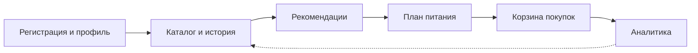
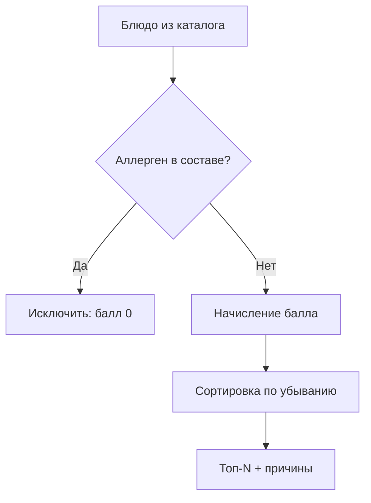
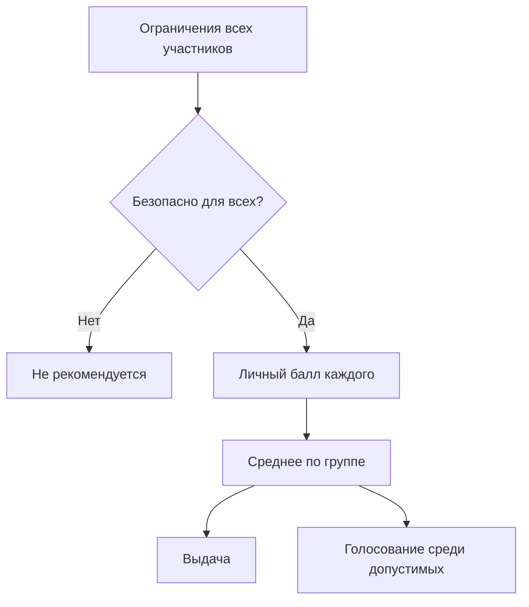
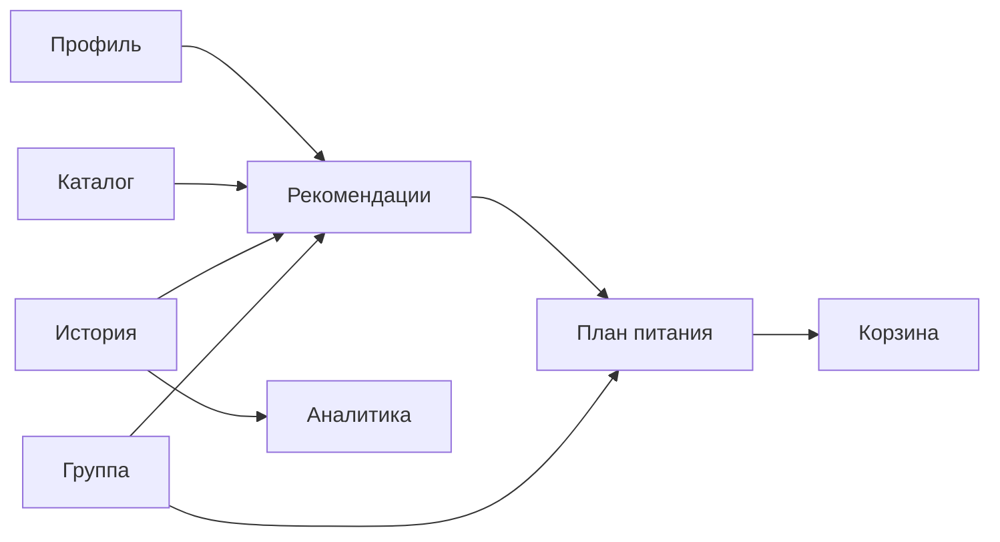
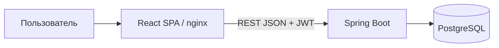

# Диаграммы для §1.3 (Mermaid → draw.io / export PNG)

## Рисунок 1.3 — Жизненный цикл пользователя

## Рисунок 1.4 — Персональная рекомендация

## Рисунок 1.5 — Групповой подбор

## Рисунок 1.6 — Потоки между модулями

## Рисунок 2.1 — Архитектура прототипа (гл. 2)

